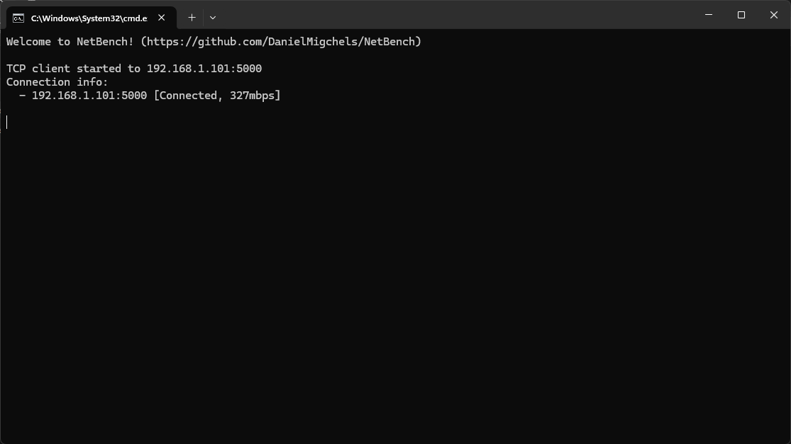
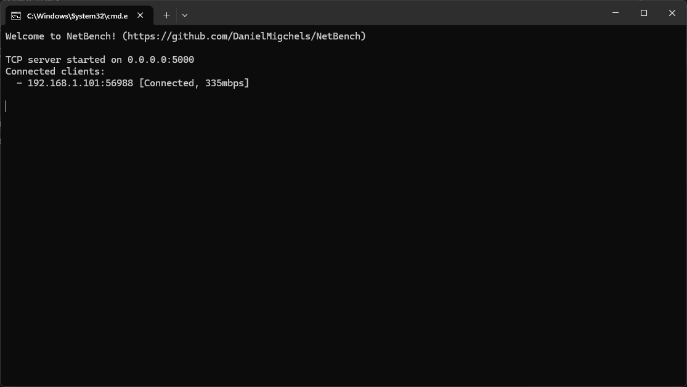

# NetBench

Free and open-source .NET ip-network benchmarking tool in the spirit of Iperf. (https://iperf.fr/)




## Install NetBench
Download the lastest release from the [Releases](https://github.com/DanielMigchels/NetBench/releases) page

## How to use NetBench

Start a server on the host machine
```
netbench -s 0.0.0.0:5000
```

Start a client on the client machine
```
netbench -c 192.168.1.100:5000
```

Enable logging to a file using `-o Output.txt`
